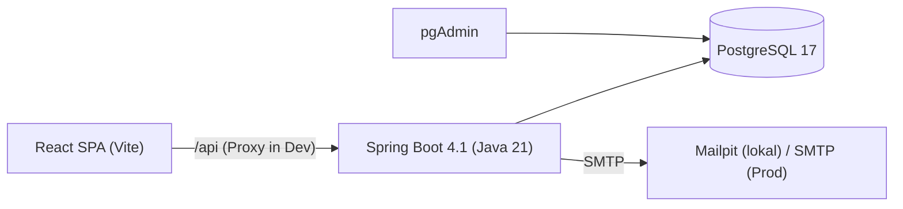
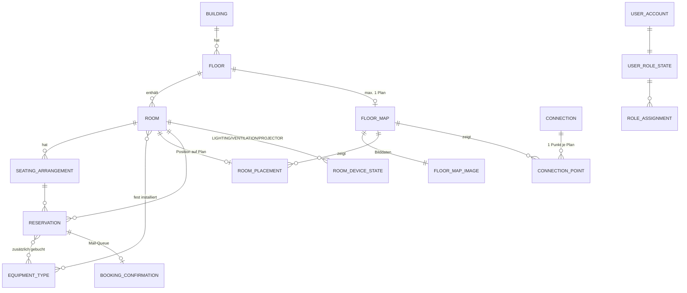
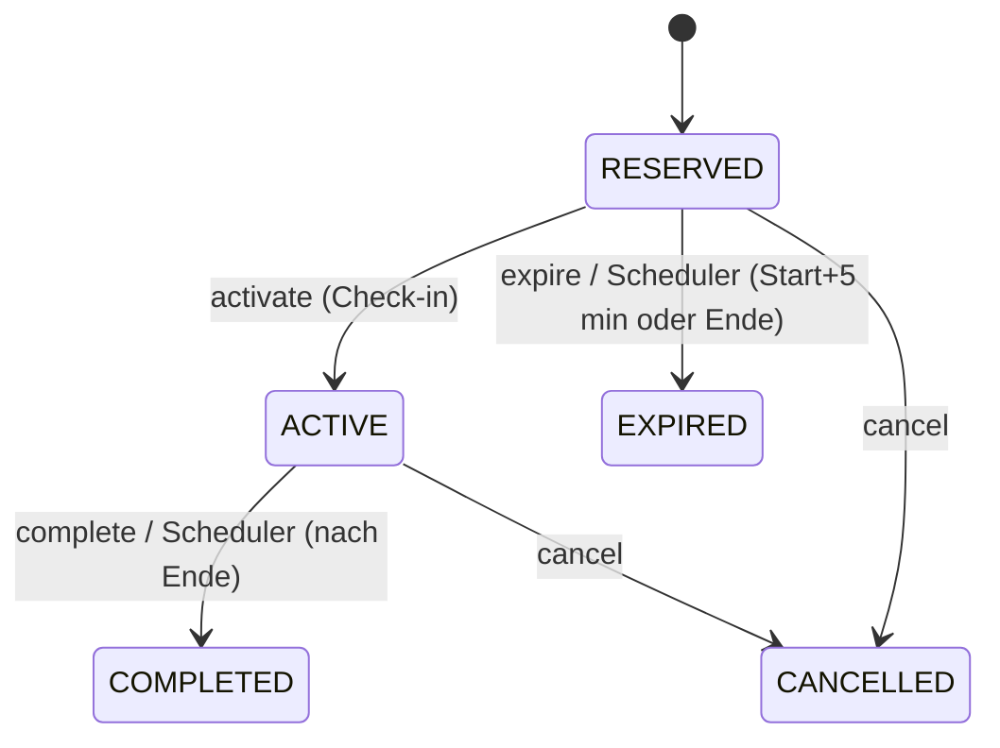

# Raumlotse – Systemdokumentation

Stand: 2026-10-06 · Branch `dev`; Befunde S1, S2, S3, F1, F3, P5 sind auf Branch `013-user-view-admin-mode` behoben (Beschreibung darunter = Zustand vor Feature 013) · Zweck: Ausgangsbasis für Review und Refactoring/Redesign.

> **Lesehinweis.** Abschnitte 1–9 beschreiben den **Ist-Zustand** (aus Code, Migrationen, Konfiguration und Specs abgeleitet). Abschnitt 10 enthält **Befunde** für Review/Redesign; sie sind nach Schwere sortiert und jeweils mit Fundstelle belegt. Befunde, die nur aus dem Code gelesen und **nicht durch Ausführung verifiziert** wurden, sind als solche markiert.

---

## 1. Überblick

Raumlotse ist eine Web-Anwendung zur Seminar-/Raumreservierung (MCI, Kontext Hochschul-Infrastruktur). Fachlich umfasst der Stand:

| Bereich | Inhalt | Spec |
|---|---|---|
| Raumverwaltung | Gebäude, Etagen, Räume, Sitzordnungen, Ausstattungskatalog; (De-)Aktivieren, Löschen | 001 |
| Navigation/Design | Navigationsleiste, Design-System | 002 |
| Rollenverwaltung | 5 Rollen, Admin-UI, Optimistic Locking, „letzter Admin"-Schutz | 003 |
| Login | E-Mail/Passwort, Session-Cookie, CSRF, Login-Cooldown | 004/005 |
| Reservierungen | Anlegen, Konfliktprüfung, Statusmaschine, Check-in, Auto-Expire | 004, 007, 009 |
| Anzeige / Status | Raum-Display mit aktueller/nächster Reservierung | 005, 009 |
| Gerätesteuerung | Licht/Lüftung/Beamer pro Raum (Stub-Gateway) | 006 |
| Raumsuche | Filter nach Kapazität, Gebäude, Bestuhlung, Ausstattung, Barrierefreiheit, Zeitfenster | 008 |
| Mail-Bestätigung | Optionale Buchungsbestätigung über DB-Queue + SMTP | 010 |
| Kartenplatzierung | Etagenpläne (PNG/JPEG), Raum-Platzierung, Treppen/Aufzug-Verbindungen | 012 |

Noch **nicht** vorhanden: Routing/Wegfindung (012 bereitet sie nur vor), Statistik (Branch `origin/011-admin-statistics`, nicht gemergt), Hochschul-Anbindung (LDAP/SSO/LMS), echte Geräteanbindung, rollenbasierte Autorisierung außerhalb von Admin-Bereichen (siehe §10).

## 2. Architektur



- **Monolith**, drei Schichten: `controller` → `service` → `repository` (Spring Data JPA/Hibernate), Entities in `domain`, Transfer-Objekte in `dto`. Schema-Verwaltung ausschließlich über Flyway (V1–V13).
- **Frontend**: reine SPA, kein Server-Side-Rendering. Kein Produktions-Deployment des Frontends definiert (kein Dockerfile/Nginx, nur `vite dev` mit Proxy).
- **Session-basierte Auth** (kein JWT): `JSESSIONID`-Cookie, HttpOnly, SameSite=Lax, 30 min Inaktivität, CSRF-Token über `/api/auth/csrf`.
- **Hintergrundjobs** (Spring `@Scheduled`, im selben Prozess, ohne verteilte Sperre – siehe §10):
  - `ReservationExpirationScheduler` (alle 30 s): RESERVED → EXPIRED (nach 5 min Karenz) und ACTIVE → COMPLETED (nach Endzeit).
  - `BookingConfirmationWorker` (Standard 1 s): Queue-Verarbeitung, Stale-Recovery.
  - `LoginAttemptCleanupService`: räumt abgelaufene Login-Zustände auf.
- **Zeit**: `Clock`-Bean (`ClockConfig`), Zeitzone für Mails `Europe/Berlin`; Reservierungszeiten `TIMESTAMPTZ`/`Instant`.

### Verzeichnisstruktur

```text
backend/src/main/java/at/mci/igp/raumlotse/
  config/      Security, Clock, Flyway, Passwort, Fixture, Properties, Policy-Konstanten
  controller/  REST-Controller (16)
  domain/      JPA-Entities und Enums (~30)
  dto/         Request/Response-Records (~40)
  exception/   Fachliche Exceptions + GlobalExceptionHandler / UserRoleExceptionHandler
  repository/  Spring-Data-Repositories (17)
  service/     Fachlogik, Filter, Worker, Scheduler (~40)
backend/src/main/resources/db/migration/   V1 … V13
frontend/src/  API/ auth/ components/ pages/ types/ utils/ test/
specs/         Spec-Kit-Artefakte je Feature (spec, plan, data-model, contracts, tasks)
workflows/     validate-main-source.yml   (siehe §10, nicht unter .github/)
dev-Workflow.json, main-workflow.json      GitHub-Ruleset-Exporte
```

## 3. Technologie-Stack

| Schicht | Technik |
|---|---|
| Backend | Java 21, Spring Boot 4.1.1 (Jackson 3 – Paket `tools.jackson`), Spring MVC, Spring Security, Spring Data JPA, Bean Validation, Spring Mail, Flyway, Maven (Wrapper) |
| Frontend | React 19, TypeScript, Vite, React Router 7, Zod 4 (Formular-Schemas `*Schema.ts`), lucide-react, Vitest 5 + Testing Library, ESLint |
| Datenbank | PostgreSQL 17 (`gen_random_uuid`, Array-Spalten, partielle Indizes, Funktions-Indizes) |
| Betrieb | Docker Compose (db, pgAdmin, Mailpit, backend); Frontend läuft separat |
| Tests | JUnit/MockMvc, Testcontainers (PostgreSQL), Vitest |

## 4. Domänenmodell



Weitere Tabellen: `login_attempt_state` (HMAC-Schlüssel → Fehlzeitpunkte, Sperre), `role_mutation_guard` (Singleton-Zeile als globaler Sperranker für Rollenänderungen).

### Schlüsselregeln (im Schema erzwungen)

- Namen eindeutig **case-insensitive** (`lower(name)`-Indizes): Gebäude global, Etage je Gebäude, Sitzordnung je Raum, Verbindung global.
- **Status** `ACTIVE`/`INACTIVE` als Soft-Deactivation für Gebäude/Etage/Raum/Ausstattung; Löschen wird durch „Dependent-History-Checker" (`NoDependentHistoryChecker`, `RoomDependentHistoryChecker`, `ReservationRoomHistoryChecker`) blockiert, wenn Reservierungshistorie existiert.
- Reservierung: `end_time > start_time`, Status ∈ {RESERVED, ACTIVE, COMPLETED, EXPIRED, CANCELLED}, `expected_attendees > 0`.
- Koordinaten (Platzierung, Verbindungspunkte) als **relative Anteile** `NUMERIC(6,5)` ∈ [0,1] → zoom-/auflösungsunabhängig.
- Passwort-Hash-Format per CHECK auf `{pbkdf2-sha256-600000-v1}` fixiert.
- `booking_confirmation`: Zustandsautomat vollständig per CHECK-Constraint abgebildet; genau **ein** Versuch (`attempt_count ≤ 1`), `reservation_id` UNIQUE.

### Reservierungs-Statusmaschine



Konflikte werden nur für RESERVED/ACTIVE geprüft (halboffenes Intervall, `findConflictingReservations`); Anlegen sperrt die Raumzeile pessimistisch (`findByIdForUpdate`).

## 5. Sicherheitsarchitektur

**Filterkette** (`SecurityConfig`): `SecurityContextHolderFilter` → `CurrentAccountFilter` (prüft bei jeder Anfrage, ob der Account noch existiert; sonst Session invalidieren → 401) → `RoleAccessFilter` → `authorizeHttpRequests`.

- Öffentlich: `GET /api/health`, `GET /api/auth/csrf`, `POST /api/auth/login`. **Alles andere `authenticated()`**.
- CSRF: Spring-Default (Session-Token), Frontend holt Token lazy (`client.ts`) und sendet Header bei unsicheren Methoden.
- Login (`LoginService` / `LoginAttemptService`): Session-ID-Wechsel (`changeSessionId`), CSRF-Token wird zurückgesetzt, Fehlversuche je HMAC(E-Mail-kanonisiert, Schlüssel `AUTH_ATTEMPT_HMAC_KEY`) gezählt (max. 5 Zeitpunkte), Cooldown → 429 + `Retry-After`. Keine Konto-Enumeration (einheitliche Fehlermeldung).
- Fehlerformat: `Problem` (RFC-7807-ähnlich, mit `code`, optional `retryAfterSeconds`, `errors[]`).
- Principal: `AuthenticatedUser(userId, displayName)`; **Spring-`GrantedAuthority`-Liste ist leer**. Rollen werden nicht in den Security-Kontext geladen, sondern bei Bedarf aus der DB gelesen.
- Admin-Prüfung: `RoleAccessFilter.shouldNotFilter` aktiviert die Prüfung **nur** für (a) `/api/admin/users/**` und (b) schreibende Methoden auf `/api/maps/**`, `/api/connections/**`, `/api/floors/*/map`.
- Lokaler Fixture-Account: nur mit Profil `local-auth-fixture`; wird ADMIN, solange keinerlei Rollenzuweisung existiert.

### Autorisierungsmatrix (Ist)

| Endpunktgruppe | Anforderung serverseitig |
|---|---|
| `/api/admin/users/**` | ADMIN |
| Karten/Platzierungen/Verbindungen – schreibend | ADMIN |
| Karten/Verbindungen – lesend | eingeloggt |
| `/api/buildings`, `/floors`, `/equipment-types`, `/rooms` – **alle schreibenden** | **nur eingeloggt** |
| `/api/rooms/{id}/reservations` (POST) | eingeloggt |
| `/api/reservations/{id}` PATCH, activate, complete, expire, cancel | **nur eingeloggt** (keine Besitzprüfung) |
| `POST /api/reservations/expire-unattended` | **nur eingeloggt** |
| Gerätesteuerung | eingeloggt **und** eigene, ACTIVE, laufende Reservierung im Raum |

## 6. Backend-Komponenten

### 6.1 REST-API (Auszug nach Controller)

Vollständige Liste: `README.md`; Verträge: `specs/*/contracts/`.

| Controller | Pfade | Anmerkung |
|---|---|---|
| `AuthController`, `CsrfController`, `CurrentRolesController` | `/api/auth/login|me|csrf|roles` | Login, Identität, eigene Rollen |
| `UserRoleController` | `/api/admin/users`, `/{id}/roles` (GET/PUT) | PUT mit `expectedVersion` (Optimistic Locking, Zahl als String wegen Long-Präzision → `RoleVersionDeserializer`) |
| `BuildingController`, `FloorController`, `EquipmentTypeController`, `RoomController` | CRUD + deactivate/reactivate | Etagen unter `/buildings/{id}/floors` (anlegen/listen) und `/floors/{id}` |
| `RoomSearchController` | `/api/rooms/search`, `/search/seating-arrangements` | `RoomSearchCriteria` entscheidet in-memory (`matches`) |
| `ReservationController` | s. §5-Matrix | Eigene `resolveUser`-Logik (dupliziert Identitätsauflösung, enthält Fallback auf `UserDetails`) |
| `RoomDeviceController` | `/api/rooms/{id}/device-controls[/{kind}]` | |
| `FloorMapController`, `RoomPlacementController`, `ConnectionController` | `/api/maps…`, `/api/connections…`, `PUT /api/floors/{id}/map` | Multipart-Upload, ≤10 MB |
| `HealthController` | `/api/health` | |

Fehlerabbildung zentral: `GlobalExceptionHandler` (Validation → 400 mit `errors[]`, `NotFoundException` → 404, `ConflictException` → 409, Device → 403/503, Map-Fehler), `UserRoleExceptionHandler` für Rollen.

### 6.2 Reservierung (`ReservationService`, 387 Zeilen)

- Validierung manuell im Service (zusätzlich zu Bean Validation in den DTOs).
- Ablauf `createReservation`: Eingabeprüfung → Raum sperren → Status/Sitzordnung/Kapazität → Konfliktprüfung → Zusatzausstattung auflösen (nicht bereits installiert, aktiv) → speichern → optional Queue-Eintrag (`emailNotification`).
- `createdBy` speichert den **Anzeigenamen**, `createdByUserId` die User-ID; `reservedFor` ist Freitext („designierte Person").
- Turnover-Puffer: Platzhalter `calculateTurnoverBuffer` → immer `Duration.ZERO`.
- Konstruktor-Überladungen (4×) und Legacy-Methode `createReservation(roomId, request)` mit aus `createdBy` abgeleiteter UUID – Reste aus Spec 004, vor Einführung der Authentifizierung.

### 6.3 Raumsuche

`RoomSearchService`: lädt Kandidaten (aktive Räume, optional je Gebäude; Hibernate `default_batch_fetch_size=100` gegen N+1), holt belegte Raum-IDs für das Zeitfenster und filtert in Java mit `RoomSearchCriteria.matches`. Performance-Test: `RoomSearchPerformanceIntegrationTest`.

### 6.4 Gerätesteuerung

`RoomDeviceService` → `RoomDeviceGateway` (Interface). Einzige Implementierung `PersistedRoomDeviceGateway` ist ein **No-Op** („bis physische Anbindung verfügbar"); Zustand wird nur in `room_device_state` persistiert. Beamer-Steuerung nur, wenn Raum aktiven Equipment-Typ mit Code `PROJECTOR` hat (Code per V11 aus Name abgeleitet). Zustandszeilen werden lazy beim Lesen angelegt (Schreiben in `readOnly`-Transaktion – siehe §10).

### 6.5 Mail-Benachrichtigung (Transactional-Outbox-Muster)

`BookingConfirmationQueueService.enqueue` (in der Reservierungs-Transaktion) → `BookingConfirmationWorker` pollt: `recoverStale` → `claimPending` → je Eintrag `deliveryDetails` → `SmtpBookingConfirmationMailGateway.send` → `markSent`/`markFailed(code)`. Fehlercodes: `RECIPIENT_UNAVAILABLE`, `MESSAGE_FORMAT_FAILED`, `SMTP_REJECTED`, `WORKER_INTERRUPTED`. **At-most-once**: kein Retry (`attempt_count ≤ 1`). Mail-Adresse wird erst beim Versand aus `user_account` gelesen. Worker abschaltbar über `booking-confirmation.worker-enabled`.

### 6.6 Karten (Feature 012, **noch nicht committet**)

- `FloorMap` (1:1 zu Etage, `image_version` für Cache-Busting) und `FloorMapImage` (BYTEA in separater Tabelle, damit Metadatenabfragen nicht das Bild laden).
- `MapImageValidator`: prüft Typ (PNG/JPEG per Inhalt), Größe, Maße; Seitenverhältnis-Änderung beim Ersetzen wird gemeldet (`aspectChanged`, Toleranz 1 %).
- Platzierung: PK = `room_id` → ein Raum höchstens auf einem Plan; `ON DELETE CASCADE` bei Plan/Raum.
- Verbindungen: benannte Treppen/Aufzüge mit je höchstens einem Punkt pro Plan – Grundlage für späteres Etagenübergreifendes Routing.
- `FloorService` (geändert): Etagen-Deaktivierung/Löschung wird gegen vorhandene Karten abgesichert (`FloorServiceMapGuardTest`).

## 7. Frontend

**Routing** (`App.tsx`): `/login` öffentlich; alles andere unter `RequireAuth`; `/admin/users*` zusätzlich `RequireAdmin`.

| Route | Seite |
|---|---|
| `/` | `HomePage` (Dashboard, `MyUpcomingReservations`) |
| `/locations` | `LocationCatalogPage` (Gebäude/Etagen, Ausstattung) |
| `/rooms`, `/rooms/new`, `/rooms/:id`, `/rooms/:id/edit` | Liste + Suche, Formular, Detail + Reservierung |
| `/rooms/:id/display` | `RoomDisplayPage` (Status, nächste Reservierung) |
| `/rooms/:id/control` | `RoomDeviceControlPage` |
| `/maps`, `/maps/:mapId` | `MapPage` (Admin: Upload, Platzieren, Verbindungen) |
| `/admin/users`, `/admin/users/:id/roles` | Rollenverwaltung |

**Strukturen**
- `API/*.ts`: dünne Wrapper über `apiRequest` (`client.ts`): CSRF-Handling, `ApiError`, 401 → Event `raumlotse:auth-expired` → `AuthProvider` setzt Sitzung zurück.
- `auth/`: `AuthProvider` (Context), `useAuth`, `useCurrentRoles`, `RequireAuth/RequireAdmin`.
- `components/<Feature>/`: je Komponente `.tsx`, `.css`, `.test.tsx`; Formulare mit Schema-Validierung (`loginSchema`, `reservationFormSchema`).
- `RoomSearch/roomSearchParams.ts`: Filter ⇄ URL-Parameter.
- `RoomDisplay/roomDisplayLogic.ts`: reine Logik, getrennt vom Rendering (gut testbar).
- `FloorMap/`: `MapCanvas` (Klick/Drag/Pfeiltasten), `ConnectionLayer`, `UnplacedRoomList`, `MapUploadControl`, `MapSelector`.
- UI-Sprache gemischt: Navigation deutsch („Räume", „Benutzerrollen"), README/Specs/Fehlermeldungen größtenteils englisch.
- Admin-UI-Gating: Nur Navigation (`access.admin`) und `/admin/users`-Routen. Seiten wie `/rooms/new` sind clientseitig für alle Eingeloggten erreichbar.

## 8. Betrieb und Konfiguration

| Thema | Details |
|---|---|
| Lokaler Start | `.env` aus `.env.example`; `docker compose up --build`; Frontend `npm run dev` |
| Pflicht-Secrets | `POSTGRES_PASSWORD`, `PGADMIN_*`, `AUTH_ATTEMPT_HMAC_KEY` (stabil, ≥32 Byte, Base64) |
| Wichtige Variablen | `SESSION_COOKIE_SECURE` (Standard `true`, im Compose `false`), `SPRING_PROFILES_ACTIVE`, `AUTH_FIXTURE_*`, `MAIL_*` (Timeouts, Poll, Batch, Stale-Threshold) |
| Mail lokal | Mailpit SMTP `:1025`, UI `:8025` |
| Ports | Frontend 5173, Backend 8080, pgAdmin 8081, Postgres 5432 |
| Upload | `multipart.max-file-size: 10MB`, `max-request-size: 11MB` |
| Logging | strukturierte Schlüssel-Logs (`authentication_failure code=…`, `room_search result_count=…`, `BOOKING_CONFIRMATION_*`); Privacy-Tests prüfen, dass keine PII/Secrets geloggt werden |
| Git-Workflow | Feature-Branches → `dev` → `main` (PR nach `main` nur aus `dev`; Rulesets als JSON exportiert, Quelle laut Datei: Repository `Crimson8230/bug-tracking-system`) |
| Entwicklungsprozess | Spec Kit (`specs/NNN-…/`: spec → plan → tasks → implement) |

## 9. Teststand

| Bereich | Umfang |
|---|---|
| Frontend | 281 Vitest-Tests in 40 Dateien – **am 2026-10-06 ausgeführt: alle grün**; `eslint` und `tsc -b` ohne Meldungen |
| Backend | ~100 Testklassen: Controller (MockMvc), Service (Unit), Repository/Integration (Testcontainers), Security-Policy, Migration (`MigrationVersionTest`, `MapMigrationIntegrationTest`, `UserRoleMigrationIntegrationTest`), Concurrency (Login-Cooldown, Rollen, Raum-Update), Performance (Raumsuche, Karten, Gerätesteuerung), Privacy-Logging |
| Backend-Ausführung | **Nicht ausgeführt** (benötigt Docker/Testcontainers). Ergebnisse unbekannt. |
| CI | Keine wirksame: `workflows/validate-main-source.yml` liegt außerhalb von `.github/workflows/` und wird von GitHub nicht ausgeführt; es existiert ohnehin nur eine Branch-Regel, kein Build/Test-Job |
| Fehlend | Keine E2E-Tests, keine Coverage-Messung, kein Frontend-Integrationstest gegen echtes Backend |

---

## 10. Befunde für Review und Redesign

Schwere: **K** kritisch (Sicherheit/Fachlichkeit), **H** hoch, **M** mittel, **N** niedrig/Hygiene.

### 10.1 Sicherheit und Autorisierung

| # | Sev. | Befund | Fundstelle |
|---|---|---|---|
| S1 | **K** · ✅ *behoben in Feature 013 (Spec `specs/013-user-view-admin-mode`)* | **Fehlende Autorisierung auf Stammdaten.** Gebäude, Etagen, Ausstattung und Räume lassen sich von *jedem* eingeloggten Benutzer anlegen, ändern, deaktivieren und löschen. Die Admin-Prüfung greift nur für `/api/admin/users` und Karten-Schreibzugriffe. Die UI blendet nur die Navigation aus (Frontend-Gating ist keine Sicherheit). | `RoleAccessFilter.shouldNotFilter/isMapWrite`, `SecurityConfig` (nur `anyRequest().authenticated()`) |
| S2 | **K** · ✅ *behoben in Feature 013 (Spec `specs/013-user-view-admin-mode`)* | **Keine Besitzprüfung bei Reservierungen.** `PATCH`, `activate`, `complete`, `expire`, `cancel` und `GET /reservations/{id}` prüfen nicht, wem die Reservierung gehört. Jeder Eingeloggte kann fremde Buchungen stornieren/umdeuten oder einchecken (und damit die Gerätesteuerung für den Ersteller freischalten). | `ReservationController`, `ReservationService.*Reservation` |
| S3 | **H** · ✅ *behoben in Feature 013 (Spec `specs/013-user-view-admin-mode`)* | `POST /api/reservations/expire-unattended` (Wartungs-Sweep) ist für jeden Eingeloggten aufrufbar. | `ReservationController` |
| S4 | **H** | **Rollenmodell ist nur teilweise wirksam.** Fünf Rollen (`ADMIN`, `UNIVERSITY_STAFF`, `STUDENT`, `LECTURER`, `VIEWER`) sind modelliert und pflegbar, aber nur `ADMIN` wird je ausgewertet. `VIEWER` darf trotzdem reservieren. Principal hat keine `GrantedAuthority`s → Spring-Mechanismen (`@PreAuthorize`, `hasRole`) sind ungenutzt. Autorisierung ist ein handgebauter Pfad-Filter (String-Vergleiche auf Pfaden), der bei neuen Endpunkten leicht vergessen wird (Default: *erlaubt*). | `RoleAccessFilter`, `UserRoleSafety`, `Role` |
| S5 | **M** | Admin-Check kostet pro Anfrage eine DB-Abfrage (`assignments.roles(actor)`) im Filter; `CurrentAccountFilter` macht zusätzlich je Anfrage `findById`. Bewusst (sofortige Entziehung), aber skaliert nicht ohne Cache/Authorities-Refresh. | `CurrentAccountFilter`, `UserRoleSafety.requireAdmin` |
| S6 | **M** | Kartenbilder werden an alle Eingeloggten ausgeliefert (gewollt), aber Bildinhalt wird nur per Validator geprüft; kein Virenscan/Re-Encoding (z. B. Metadaten). Bytes liegen in der DB (BYTEA). | `MapImageValidator`, `FloorMapService` |
| S7 | **N** | `SESSION_COOKIE_SECURE` Default `true`, im Compose Default `false` → Fehlkonfigurationsrisiko; PBKDF2 600k Iterationen fest in CHECK-Constraint (Algorithmuswechsel erfordert Migration). | `application.yaml`, `docker-compose.yml`, V6 |

### 10.2 Fachlogik / Korrektheit

| # | Sev. | Befund | Fundstelle |
|---|---|---|---|
| F1 | **H** · ✅ *behoben in Feature 013 (Spec `specs/013-user-view-admin-mode`)* | **„Meine anstehenden Reservierungen" vermutlich funktionslos (nicht ausgeführt verifiziert).** Der Service filtert `createdBy` (gespeichert: *Anzeigename*) mit `user.userId().toString()`. Beim Anlegen wird `createdBy = displayName` gesetzt. Treffer wären nur bei Namensgleichheit mit der UUID möglich. Tests mocken den Service bzw. nutzen künstliche Werte, decken die Kombination Anlegen→Abfragen nicht ab. Korrektur: Abfrage nach `createdByUserId`. | `ReservationService.getMyUpcomingReservations`, `ReservationRepository.findTop10ByCreatedBy…`, `ReservationController.getMyUpcomingReservations` |
| F2 | **H** | **Doppelte Identität in `Reservation`:** `createdBy` (Freitext/Name, nicht eindeutig, bei Namensänderung veraltet) und `createdByUserId` (nullable; `NULL` bei Altdaten und Legacy-Pfad). Berechtigungen (Gerätesteuerung) nutzen die ID, Anzeigen/Abfragen den Namen. | V4, V10, V11, `Reservation` |
| F3 | **M** · ✅ *behoben in Feature 013 (Spec `specs/013-user-view-admin-mode`)* | Anlegen validiert `startTime` mit `Instant.now()` statt der injizierten `Clock` – Zeitlogik inkonsistent und schwer testbar. | `ReservationService.createReservation` |
| F4 | **M** | Konflikt-Garantie nur anwendungsseitig (Pessimistic Lock auf `room`). Kein DB-Constraint (z. B. `EXCLUDE USING gist` mit `tstzrange`) – Umgehung durch andere Schreibpfade (Statuswechsel, künftige Importe) möglich. Die Sperre serialisiert zudem alle Buchungen je Raum. | `RoomRepository.findByIdForUpdate`, V4 |
| F5 | **M** | Scheduler-Sweeps laufen je Instanz. Mehrere Backend-Instanzen → doppelte Arbeit (optimistisches Locking fängt Konflikte, aber ohne Leader-Election/`SELECT … FOR UPDATE SKIP LOCKED`). Mail-Worker `claimPending` ist per Queue-Service für Parallelität vorgesehen (Annahme, nicht geprüft). | `ReservationExpirationScheduler`, `BookingConfirmationWorker` |
| F6 | **M** | Scheduler-Sweep lädt alle Kandidaten und speichert einzeln in **einer** `@Transactional`-Service-Methode; ein `OptimisticLockingFailureException` wird *innerhalb* der Transaktion gefangen, die dadurch ggf. bereits als rollback-only markiert ist. Verhalten bei Fehlern unklar/unverifiziert. | `ReservationService.expireUnattendedReservations/completeOverdue…` |
| F7 | **M** | Mail: genau ein Versuch, kein Retry/Backoff; transiente SMTP-Fehler führen dauerhaft zu `FAILED`. Bewusste Spec-Entscheidung („at most once"), für Produktion zu überdenken. | `BookingConfirmationWorker`, V12 |
| F8 | **M** | Gerätesteuerung: `GET` schreibt Zustandszeilen lazy (`response()` → `save` in `readOnly=true`-Transaktion; je nach Provider wirkungslos oder fehlerhaft) und Gateway ist No-Op → Zustand „an" bedeutet nicht, dass etwas geschaltet wurde. | `RoomDeviceService`, `PersistedRoomDeviceGateway` |
| F9 | **N** | `calculateTurnoverBuffer` (immer 0), `ReservationCreateRequest.createdBy` (Legacy), `seatingArrangementRepository`-Parameter ungenutzt → toter Code. | `ReservationService` |

### 10.3 Struktur, Design, Wartbarkeit

| # | Sev. | Befund |
|---|---|---|
| D1 | **H** | **Uneinheitlicher Code-Stil.** Zwei Welten: klassisch formatierter Code (z. B. `ReservationService`) vs. extrem komprimierter Code mit mehreren Anweisungen je Zeile (`RoleAccessFilter`, `UserRoleSafety`, `UserRoleService`, Teile der Rollen-Controller). Letzteres erschwert Review und Diffs. Zusätzlich 8-Space-Einrückung in `SecurityConfig`/Controllern gegenüber 4 Spaces sonst; vollqualifizierte Klassennamen statt Imports. Kein Formatter/Checkstyle konfiguriert. |
| D2 | **H** | **Service-Schicht ohne Interfaces, aber mit Cross-Cutting-Filtern im `service`-Paket** (`CurrentAccountFilter`, `RoleAccessFilter` liegen unter `service`, gehören in ein `security`-Paket). Security-Tests liegen dagegen in `…/security/`. |
| D3 | **M** | **Domain und Transport vermischt:** Controller geben teils Entities weiter (`RoomService.create` liefert `Room`, DTO-Mapping über `Response.from(entity)` statisch). `ReservationService` gibt DTOs zurück (Service kennt Transportmodell). Keine klare Anwendungs-/Domänengrenze. |
| D4 | **M** | **Identitätsauflösung dupliziert:** `ReservationController.resolveUser` (mit Fallback über `UserDetails` → name-basierte UUID, in Produktion nie genutzt), `RoomDeviceService.authorize` liest `SecurityContextHolder` direkt, `RoleIdentityAdapter`, `UserRoleController(Authentication)`. Empfehlung: ein `CurrentUser`-Argument-Resolver. |
| D5 | **M** | **Validierung dreifach:** Bean Validation (DTO), manuelle `IllegalArgumentException`s im Service, DB-Constraints. `IllegalArgumentException` → 400 im `GlobalExceptionHandler` fängt damit auch *unbeabsichtigte* interne Fehler als 400 ab. |
| D6 | **M** | **Fehlercodes uneinheitlich:** `Problem.code` ist bei Auth/Rollen/Karten gesetzt, bei Raum-/Reservierungsfehlern nicht durchgängig; Frontend wertet überwiegend `detail`-Text aus. Zwei Exception-Handler-Klassen mit unterschiedlichen Konventionen. |
| D7 | **M** | **Datenmodell-Brüche:** `room.created_at` ist `TIMESTAMP` ohne Zeitzone, alle anderen `TIMESTAMPTZ`; `status` als `TEXT` ohne CHECK bei Building/Floor/Room (nur bei Reservierung/Confirmation); keine FK-Kaskaden-Strategie einheitlich (`ON DELETE CASCADE` bei Seating, Map, Placement, Device; Restrict bei Reservierung). |
| D8 | **M** | **Liste statt Paging:** Räume/Reservierungen/Gebäude werden vollständig geladen; Suche filtert in Java. Bei > ein paar tausend Räumen/Reservierungen ineffizient. Kein Paging außer Benutzerliste. |
| D9 | **M** | **Frontend:** große Komponenten (`BuildingCatalog` 289, `RoomForm` 334, `ReservationList` 323, `ReservationForm` 319 Zeilen) mit Datenabruf, Zustand und Darstellung gemischt; kein Daten-Cache/Query-Layer (manuelles `useEffect`-Laden); Types teils doppelt zu Backend-DTOs (manuell gepflegt, kein OpenAPI-Codegen, obwohl `contracts/openapi.yaml` existiert). Mehrsprachigkeit nicht strukturiert (Strings hartkodiert, gemischt DE/EN). |
| D10 | **M** | **Zugriffsrollen im Frontend** werden über zusätzliche Request (`useCurrentRoles`/`/api/auth/roles`) geladen; UI-Berechtigungsmodell beschränkt sich auf `admin` ja/nein. |
| D11 | **N** | Frontend-Produktionsbuild/Deployment fehlt (kein Container, keine Reverse-Proxy-Konfiguration; `dist/` ist vorhanden). Backend-Dockerfile existiert. |
| D12 | **N** | Spring-Boot-/Jackson-3-Migration (`tools.jackson`) – Kompatibilität mit Bibliotheken prüfen; kein Dependency-Update-Mechanismus (Dependabot/Renovate). |

### 10.4 Prozess und Repository-Hygiene

| # | Sev. | Befund |
|---|---|---|
| P1 | **H** | **Kein wirksames CI** (Workflow liegt in `workflows/` statt `.github/workflows/`; beinhaltet keine Build-/Test-Schritte). Qualitätsgrenzen (281 Frontend-/~100 Backend-Testklassen) werden nirgends automatisch erzwungen. |
| P2 | **M** | **Arbeitsstand uncommitted:** 68 Dateien in `git status` (gesamtes Feature 012 + Änderungen an Security/Fehlerbehandlung/README). Review sollte nach dem Commit auf Feature-Branch `012-room-map-placement` stattfinden. |
| P3 | **M** | **Spec-Nummern inkonsistent:** doppelte Nummern (`004-…`×2, `005-…`×2, `009-…`×2), Lücke 011 (Branch `origin/011-admin-statistics` existiert, kein Spec-Ordner), Task-Checkboxen (`[x]`/`[ ]`) nicht einheitlich gepflegt → Spec-Status nicht verlässlich ablesbar. Zwei Login-Specs (004/005) mit zu klärender Beziehung. |
| P4 | **N** | `dev-Workflow.json`/`main-workflow.json` im Projektroot sind Ruleset-Exporte und verweisen auf ein *anderes* Repository (`Crimson8230/bug-tracking-system`) – vermutlich Kopiervorlage; gehören eher nach `.github/` oder in die Doku. |
| P5 | **N** · ✅ *behoben in Feature 013 (Spec `specs/013-user-view-admin-mode`)* | README listet „Planned: Authentication/authorization (room management is currently unauthenticated by design)" – veraltet und im Widerspruch zum Ist-Stand (Auth vorhanden, Autorisierung fehlt aber teilweise → siehe S1). |

## 11. Empfohlene Reihenfolge für Review / Redesign

1. **Vor jedem Redesign absichern (Bugs/Sicherheit):** S1, S2, S3, F1. Das sind kleine, klar abgegrenzte Änderungen mit hohem Risikogewinn; je ein Regressionstest ergänzen (Nicht-Admin schreibt Stammdaten → 403; Fremd-Storno → 403/404; Anlegen→„Meine Reservierungen" liefert Treffer).
2. **CI herstellen (P1)** inkl. Backend-Tests mit Testcontainers und Frontend-Lint/-Test/-Build, damit Refactoring abgesichert ist.
3. **Autorisierungskonzept neu entwerfen (S4, D4):** Rollen → `GrantedAuthority`, Endpunktregeln deklarativ in `SecurityConfig` (deny-by-default für Schreibzugriffe) oder Methodensicherheit; ein `CurrentUser`-Resolver; Rollen-Matrix je Aktion festlegen (Wer darf buchen/stornieren fremder Buchungen/Räume pflegen?).
4. **Reservierungsmodell bereinigen (F2, F3, F9):** `createdBy`-Name entfernen oder als reinen Snapshot behandeln, Legacy-Pfad löschen, Clock einheitlich; optional DB-Exclusion-Constraint (F4).
5. **Schichtung und Stil vereinheitlichen (D1–D3, D5, D6):** Formatter (z. B. Spotless) einführen, Filter ins `security`-Paket, DTO-Mapping aus Services, einheitliches Fehlerschema mit stabilen `code`s.
6. **Frontend (D9):** Typen aus OpenAPI generieren, Data-Fetching-Layer (z. B. TanStack Query), große Komponenten zerlegen, i18n-Konzept.
7. **Betrieb (F5–F8, D8, D11):** Scheduler-Verteilung/Retry-Strategie klären, Paging, Frontend-Deployment, echte Geräte-Gateway-Schnittstelle.

## 12. Offene Fragen an das Team

- Soll *jeder* Eingeloggte Stammdaten pflegen dürfen (Prototyp-Annahme laut Spec 001) oder nur `ADMIN`/`UNIVERSITY_STAFF`? Welche Rechte haben `STUDENT`, `LECTURER`, `VIEWER` konkret?
- Dürfen Admins fremde Reservierungen verwalten? Darf ein Benutzer für andere Personen buchen (`reservedFor` ist Freitext, kein User-Bezug)?
- Ist ein Retry für Buchungsmails gewünscht?
- Ziel-Integration: SSO/LDAP der Hochschule statt lokaler Konten?
- Wegfindung (Folgefeature zu 012): Graph-Modell, Gewichtungen, Barrierefreiheit als Routing-Kriterium?
- Betriebsmodell: einzelne Instanz oder mehrere (Einfluss auf Scheduler, Sessions – aktuell In-Memory/Servlet-Container-Session)?

## Anhang A – Migrationen

| Version | Inhalt |
|---|---|
| V1 | `building`, `floor` |
| V2 | `room`, `seating_arrangement` |
| V3 | `equipment_type`, `room_equipment` (Seed: Projector, Whiteboard) |
| V4 | `reservation`, `reservation_equipment` |
| V5 | `login_attempt_state` |
| V6 | `user_account` |
| V7 | `user_role_state`, `role_assignment`, `role_mutation_guard` |
| V8 | Backfill: Bestandskonten erhalten `VIEWER` |
| V9 | Barrierefrei-Attribut am Raum |
| V10 | `reservation.reserved_for`, Index „meine Reservierungen" |
| V11 | `reservation.created_by_user_id`, `equipment_type.code`, `room_device_state` |
| V12 | `booking_confirmation` |
| V13 | `floor_map`, `floor_map_image`, `room_placement`, `connection`, `connection_point` |

## Anhang B – Quellen dieser Dokumentation

Gelesen/ausgeführt: `README.md`, alle Migrationen (Auszüge V1–V13), `SecurityConfig`, `RoleAccessFilter`, `CurrentAccountFilter`, `UserRoleSafety`, `AuthController`, `LoginService`, `ReservationService`/`-Controller`/`-Repository`, `RoomDeviceService`, `BookingConfirmationWorker`, `RoomSearchService`, `FloorMapService`, `application.yaml`, `docker-compose.yml`, `App.tsx`, `client.ts`; Dateilisten aller Verzeichnisse; Frontend-Tests/Lint/Typecheck ausgeführt. **Nicht** im Detail gelesen: übrige Services/Controller, Domain-Entities, einzelne Frontend-Komponenten, Specs inhaltlich; Backend-Tests nicht ausgeführt.
