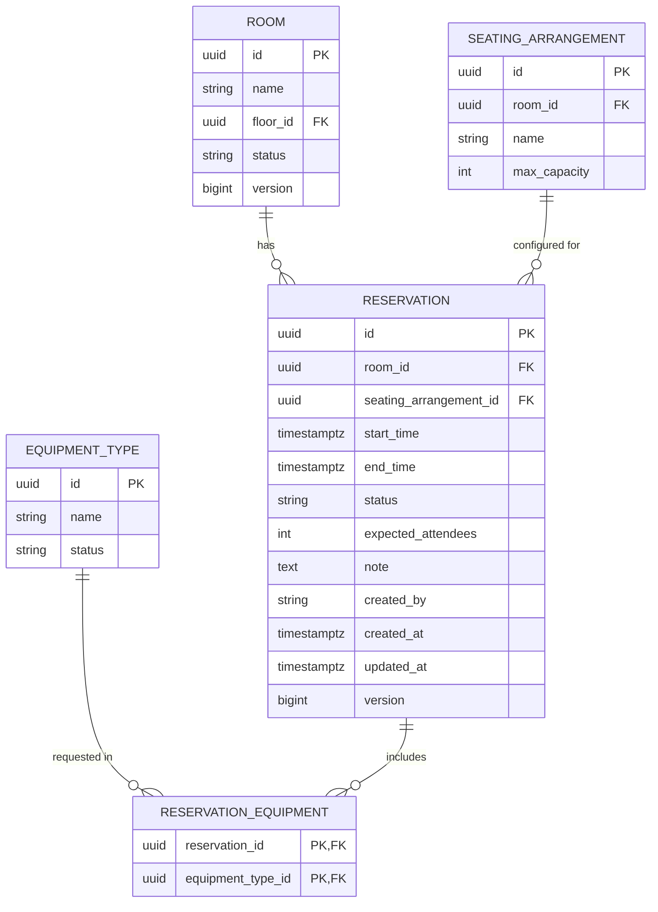
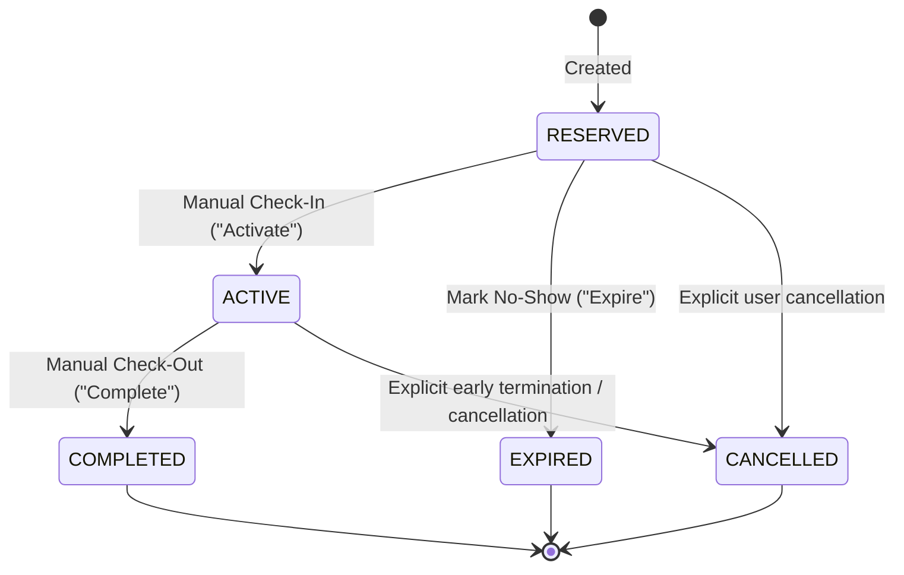

# Data Model: Room Reservations

**Branch**: `004-room-reservations` | **Date**: 2026-09-19 | **Spec**: [spec.md](./spec.md)

## Entity Relationship Diagram



---

## Entities & Attributes

### 1. `Reservation`
Represents a scheduled booking of a room for a designated time window.

| Field | Type | Nullable | Constraints & Validation | Description |
|---|---|---|---|---|
| `id` | `UUID` | No | Primary Key, Auto-generated (v4 / random) | Unique identifier |
| `room` | `Room` (`ManyToOne`) | No | Foreign Key to `room.id`, indexed | The room being booked |
| `seatingArrangement` | `SeatingArrangement` (`ManyToOne`) | No | Foreign Key to `seating_arrangement.id`, indexed | Selected seating layout |
| `startTime` | `Instant` / `timestamptz` | No | `@NotNull`, `@Future`, before `endTime` | Booking start time (inclusive) |
| `endTime` | `Instant` / `timestamptz` | No | `@NotNull`, after `startTime` | Booking end time (exclusive) |
| `status` | `ReservationStatus` (`String`) | No | `RESERVED`, `ACTIVE`, `COMPLETED`, `EXPIRED`, `CANCELLED`, default `RESERVED` | Stored lifecycle state |
| `expectedAttendees` | `int` | No | `@Min(1)`, `<= seatingArrangement.maxCapacity` | Headcount expected |
| `note` | `String` | Yes | `@Size(max = 2000)` | Remarks / setup instructions |
| `createdBy` | `String` | No | `@NotBlank`, `@Size(max = 255)` | User name / identifier |
| `createdAt` | `Instant` / `timestamptz` | No | Auto-set on create | Administrative creation timestamp |
| `updatedAt` | `Instant` / `timestamptz` | No | Auto-set on update | Administrative update timestamp |
| `version` | `Long` | No | Optimistic lock version counter | Concurrency control |
| `additionalEquipment` | `List<EquipmentType>` (`ManyToMany`) | No | Active types, not in `room.equipmentTypes` | Extra equipment requested |

---

## Lifecycle State Machine



### State Definitions
- **`RESERVED`**: Default initial state upon creation. Booking is confirmed and awaiting meeting time. Can transition to `ACTIVE`, `EXPIRED`, or `CANCELLED`.
- **`ACTIVE`**: Meeting is currently underway following manual check-in/activation. Can transition to `COMPLETED` or `CANCELLED`.
- **`COMPLETED`**: Terminal status for meetings that were activated and concluded. Permanent and immutable.
- **`EXPIRED`**: Terminal status for reservations that were never activated and lapsed (unattended no-show). Permanent and immutable.
- **`CANCELLED`**: Terminal status explicitly revoked; room is immediately released for new bookings during that window. Permanent and immutable.

---

## Database Migration (`V4__create_reservation_tables.sql`)

```sql
CREATE TABLE reservation (
    id UUID PRIMARY KEY DEFAULT gen_random_uuid(),
    room_id UUID NOT NULL REFERENCES room (id),
    seating_arrangement_id UUID NOT NULL REFERENCES seating_arrangement (id),
    start_time TIMESTAMP WITH TIME ZONE NOT NULL,
    end_time TIMESTAMP WITH TIME ZONE NOT NULL,
    status TEXT NOT NULL DEFAULT 'RESERVED',
    expected_attendees INT NOT NULL CHECK (expected_attendees > 0),
    note TEXT,
    created_by TEXT NOT NULL,
    created_at TIMESTAMP WITH TIME ZONE NOT NULL DEFAULT now(),
    updated_at TIMESTAMP WITH TIME ZONE NOT NULL DEFAULT now(),
    version BIGINT NOT NULL DEFAULT 0,
    CONSTRAINT chk_reservation_time CHECK (end_time > start_time),
    CONSTRAINT chk_reservation_status CHECK (status IN ('RESERVED', 'ACTIVE', 'COMPLETED', 'EXPIRED', 'CANCELLED'))
);

CREATE INDEX ix_reservation_room_id ON reservation (room_id);
CREATE INDEX ix_reservation_seating_arrangement_id ON reservation (seating_arrangement_id);
CREATE INDEX ix_reservation_room_time_status ON reservation (room_id, status, start_time, end_time);

CREATE TABLE reservation_equipment (
    reservation_id UUID NOT NULL REFERENCES reservation (id) ON DELETE CASCADE,
    equipment_type_id UUID NOT NULL REFERENCES equipment_type (id),
    PRIMARY KEY (reservation_id, equipment_type_id)
);

CREATE INDEX ix_reservation_equipment_equipment_type_id ON reservation_equipment (equipment_type_id);
```
