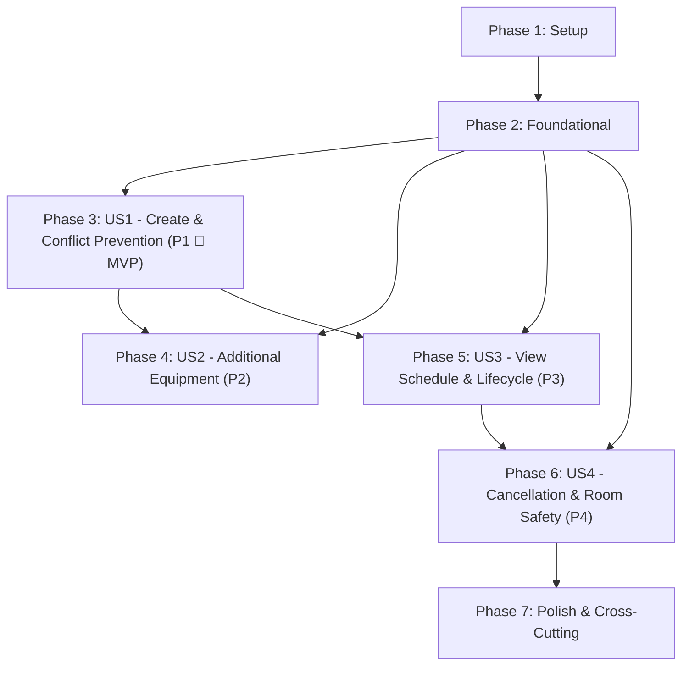

# Tasks: Room Reservations

**Branch**: `004-room-reservations` | **Date**: 2026-09-19 | **Spec**: [spec.md](./spec.md) | **Plan**: [plan.md](./plan.md)

---

## Phase 1: Setup (Shared Infrastructure)

**Purpose**: Database schema migration and frontend shared types/API baseline for room reservations.

- [ ] T001 Initialize Flyway database migration in `backend/src/main/resources/db/migration/V4__create_reservation_tables.sql` creating `reservation` table with primary key `id UUID`, foreign keys `room_id` and `seating_arrangement_id`, columns `start_time`, `end_time`, `status TEXT NOT NULL DEFAULT 'RESERVED'`, `expected_attendees INT NOT NULL`, `note TEXT`, `created_by TEXT NOT NULL`, `created_at`, `updated_at`, `version BIGINT NOT NULL DEFAULT 0`, table constraints `chk_reservation_time CHECK (end_time > start_time)`, `chk_reservation_status CHECK (status IN ('RESERVED', 'ACTIVE', 'COMPLETED', 'EXPIRED', 'CANCELLED'))`, `expected_attendees > 0`, indexes on `room_id`, `seating_arrangement_id`, and `(room_id, status, start_time, end_time)`, and join table `reservation_equipment (reservation_id, equipment_type_id)`
- [ ] T002 [P] Create TypeScript interfaces and types for room reservations in `frontend/src/types/reservation.ts` (`ReservationStatus = 'RESERVED' | 'ACTIVE' | 'COMPLETED' | 'EXPIRED' | 'CANCELLED'`, `Reservation`, `ReservationCreatePayload`, `ReservationUpdatePayload`, and `EquipmentTypeSummary`)
- [ ] T003 [P] Create frontend API client functions in `frontend/src/API/reservations.ts` for endpoints: `getAvailableEquipment`, `listRoomReservations`, `createReservation`, `getReservation`, `updateReservationMetadata`, `activateReservation`, `completeReservation`, `expireReservation`, and `cancelReservation`

---

## Phase 2: Foundational (Blocking Prerequisites)

**Purpose**: Core domain entities, DTO records, repositories, and service/controller skeletons required before any user story can be implemented.

**⚠️ CRITICAL**: No user story work can begin until this phase is complete.

- [ ] T004 Create `ReservationStatus` enum in `backend/src/main/java/at/mci/igp/raumlotse/domain/ReservationStatus.java` defining 5 lifecycle states: `RESERVED`, `ACTIVE`, `COMPLETED`, `EXPIRED`, `CANCELLED`
- [ ] T005 [P] Create `Reservation` JPA entity in `backend/src/main/java/at/mci/igp/raumlotse/domain/Reservation.java` mapped to table `reservation` with fields `id` (UUID), `room` (`@ManyToOne(fetch = FetchType.LAZY) @NotNull`), `seatingArrangement` (`@ManyToOne(fetch = FetchType.LAZY) @NotNull`), `startTime` (`@NotNull @Future`), `endTime` (`@NotNull`), `status` (`@Enumerated(EnumType.STRING) @NotNull`), `expectedAttendees` (`@Min(1)`), `note` (`@Size(max = 2000)`), `createdBy` (`@NotBlank @Size(max = 255)`), `createdAt` (`@NotNull Instant`), `updatedAt` (`@NotNull Instant`), `@Version Long version`, and `additionalEquipment` (`@ManyToMany List<EquipmentType>` mapped to `reservation_equipment`)
- [ ] T006 [P] Create DTO records in `backend/src/main/java/at/mci/igp/raumlotse/dto/` including `ReservationCreateRequest.java` (`startTime` `@NotNull @Future`, `endTime` `@NotNull`, `seatingArrangementId` `@NotNull`, `expectedAttendees` `@NotNull @Min(1)`, `additionalEquipmentTypeIds` `List<UUID>`, `note` `@Size(max = 2000)`, `createdBy` `@NotBlank @Size(max = 255)`), `ReservationUpdateRequest.java` (`expectedAttendees` `@Min(1)`, `note` `@Size(max = 2000)`), and `ReservationResponse.java` (including nested `SeatingArrangementSummary` and `EquipmentTypeResponse`)
- [ ] T007 [P] Create `ReservationRepository` in `backend/src/main/java/at/mci/igp/raumlotse/repository/ReservationRepository.java` extending `JpaRepository<Reservation, UUID>` with query methods: `findByRoomIdOrderByStartTimeAsc`, conflict check query `findConflictingReservations(UUID roomId, Instant startTime, Instant endTime)` filtering `status IN ('RESERVED', 'ACTIVE') AND start_time < :endTime AND end_time > :startTime`, `existsByRoomId(UUID roomId)`, and `existsByRoomIdAndStatusIn(UUID roomId, Collection<ReservationStatus> statuses)`
- [ ] T008 Add pessimistic write lock query method `findByIdForUpdate` (`@Lock(LockModeType.PESSIMISTIC_WRITE) @Query("select r from Room r where r.id = :id") Optional<Room> findByIdForUpdate(@Param("id") UUID id)`) in `backend/src/main/java/at/mci/igp/raumlotse/repository/RoomRepository.java` to guarantee serialized concurrency control during reservation creation
- [ ] T009 Create skeleton `ReservationService` in `backend/src/main/java/at/mci/igp/raumlotse/service/ReservationService.java` and `ReservationController` in `backend/src/main/java/at/mci/igp/raumlotse/controller/ReservationController.java` with constructor injection

**Checkpoint**: Foundation ready - user story implementation can now begin.

---

## Phase 3: User Story 1 - Create Room Reservation with Conflict Prevention (Priority: P1) 🎯 MVP

**Goal**: Users viewing a room can book it for a given future time window `[start, end)` by selecting a seating arrangement, specifying expected attendees (`1 <= expectedAttendees <= maxCapacity`), an optional note, and a non-blank `createdBy` identifier. The system prevents scheduling conflicts using pessimistic locking and rejects invalid capacity or deactivated rooms.

**Independent Test**: Book an active room via POST `/api/rooms/{roomId}/reservations`, verify the reservation is created in `RESERVED` status with administrative audit fields. Verify overlapping booking is rejected with HTTP 409 Conflict, capacity overflow is rejected with HTTP 400 Bad Request, back-to-back zero buffer booking succeeds, and deactivated room is rejected.

### Tests for User Story 1 (TDD - Mandatory under Constitution Principle I) ⚠️

> **NOTE: Write these tests FIRST, ensure they FAIL before implementation**

- [ ] T010 [P] [US1] Write failing unit tests in `backend/src/test/java/at/mci/igp/raumlotse/service/ReservationServiceTest.java` covering: successful reservation creation in `RESERVED` status, conflict rejection (HTTP 409 Conflict), adjacent back-to-back zero buffer half-open interval acceptance `[start, end)`, seating arrangement capacity validation (`expectedAttendees > maxCapacity` throws `IllegalArgumentException`), room deactivated validation (`EntityStatus.DEACTIVATED` throws `ConflictException`), past start time validation, and creator identity required validation
- [ ] T011 [P] [US1] Write failing controller tests in `backend/src/test/java/at/mci/igp/raumlotse/controller/ReservationControllerTest.java` for `POST /api/rooms/{roomId}/reservations` verifying HTTP 201 Created on valid submission, HTTP 400 Bad Request on validation errors (missing fields, blank `createdBy`, non-positive attendees, `endTime <= startTime`), HTTP 404 on unknown room or seating arrangement, and HTTP 409 on conflict
- [ ] T012 [P] [US1] Write failing integration test in `backend/src/test/java/at/mci/igp/raumlotse/ReservationCreationIntegrationTest.java` testing concurrent simultaneous reservation requests for overlapping windows on the same room to verify serialized pessimistic locking guarantees exactly one 201 and one 409
- [ ] T013 [P] [US1] Write failing frontend component tests in `frontend/src/components/ReservationForm/ReservationForm.test.tsx` testing form rendering, validation (required start time, end time, seating arrangement, attendee count, non-blank `createdBy`), capacity feedback against selected arrangement, single arrangement auto-selection, and submission handling

### Implementation for User Story 1

- [ ] T014 [US1] Implement reservation creation in `backend/src/main/java/at/mci/igp/raumlotse/service/ReservationService.java`: acquire pessimistic write lock via `roomRepository.findByIdForUpdate(roomId)`, verify room is `ACTIVE`, validate `startTime < endTime` and `startTime` is in future, validate seating arrangement belongs to room and `1 <= expectedAttendees <= seatingArrangement.getMaxCapacity()`, execute conflict query on `reservationRepository`, instantiate `Reservation` with `status = ReservationStatus.RESERVED`, save, and return `ReservationResponse`
- [ ] T015 [US1] Implement endpoint `POST /api/rooms/{roomId}/reservations` in `backend/src/main/java/at/mci/igp/raumlotse/controller/ReservationController.java` with `@Valid @RequestBody ReservationCreateRequest`, returning HTTP 201 Created with `ReservationResponse`
- [ ] T016 [US1] Implement `ReservationForm` component in `frontend/src/components/ReservationForm/ReservationForm.tsx` and styles in `frontend/src/components/ReservationForm/ReservationForm.css` with inputs for start datetime, end datetime, seating arrangement dropdown (auto-selecting when only 1 layout is available), expected attendees number input, optional note textarea, required `createdBy` text input, error feedback, and submit button
- [ ] T017 [US1] Integrate `ReservationForm` into room view in `frontend/src/pages/RoomDetailPage.tsx` (and link route in `frontend/src/App.tsx` and `frontend/src/pages/RoomListPage.tsx`) allowing users to open and submit room reservations

**Checkpoint**: At this point, User Story 1 (MVP) is fully functional and independently testable end-to-end.

---

## Phase 4: User Story 2 - Reserve Additional Equipment Not Present in Room (Priority: P2)

**Goal**: Users can select portable equipment types from the active catalog that are not already permanently installed in the target room; deactivated catalog equipment types are excluded from the selector and rejected if submitted; if all catalog equipment is already installed, an informative notice is shown.

**Independent Test**: Navigate to a room with built-in equipment. Verify the available equipment selector omits installed equipment. Select an unassigned equipment type (e.g. "Microphone"), create the reservation, and confirm it appears in the reservation response. Verify that requesting a deactivated equipment type returns HTTP 400 Bad Request.

### Tests for User Story 2 (TDD - Mandatory under Constitution Principle I) ⚠️

- [ ] T018 [P] [US2] Write failing unit tests in `backend/src/test/java/at/mci/igp/raumlotse/service/ReservationServiceTest.java` covering: available equipment calculation (filters out permanently installed room equipment and deactivated catalog items), empty list when all equipment is present, and rejection with `IllegalArgumentException` (HTTP 400) if a reservation creation request references a deactivated equipment type
- [ ] T019 [P] [US2] Write failing controller tests in `backend/src/test/java/at/mci/igp/raumlotse/controller/ReservationControllerTest.java` for `GET /api/rooms/{roomId}/available-equipment` verifying HTTP 200 with list of active uninstalled equipment types, and `POST /api/rooms/{roomId}/reservations` returning HTTP 400 when invalid/deactivated equipment is requested
- [ ] T020 [P] [US2] Write failing frontend component tests in `frontend/src/components/ReservationForm/ReservationForm.test.tsx` verifying available equipment checkboxes render unassigned active types, omit room installed types, display empty notice ("All catalog equipment is already present in this room") when none are available, and pass selected equipment IDs in submission payload

### Implementation for User Story 2

- [ ] T021 [US2] Implement `getAvailableEquipment(UUID roomId)` in `backend/src/main/java/at/mci/igp/raumlotse/service/ReservationService.java` querying `equipmentTypeRepository.findByStatus(EntityStatus.ACTIVE)` excluding `room.getEquipmentTypes()`, and update `createReservation` to validate all requested `additionalEquipmentTypeIds` are active and uninstalled, adding them to `reservation.setAdditionalEquipment(...)`
- [ ] T022 [US2] Implement endpoint `GET /api/rooms/{roomId}/available-equipment` in `backend/src/main/java/at/mci/igp/raumlotse/controller/ReservationController.java` returning HTTP 200 with `List<EquipmentTypeResponse>`
- [ ] T023 [US2] Update `frontend/src/components/ReservationForm/ReservationForm.tsx` to fetch available equipment via `getAvailableEquipment(roomId)`, render type-only checkboxes without quantities, display the empty notice when no additional equipment is available, and send selected IDs on submit

**Checkpoint**: At this point, User Stories 1 AND 2 are both independently functional and tested.

---

## Phase 5: User Story 3 - View Room Reservation Schedule and Lifecycle States (Priority: P3)

**Goal**: Users viewing a room can see all scheduled reservations with their persisted lifecycle state (`RESERVED`, `ACTIVE`, `COMPLETED`, `EXPIRED`, `CANCELLED`), view creator audit information (`createdBy`, `createdAt`), update metadata (`note`, `expectedAttendees`) on `RESERVED` bookings within seating capacity, and operate manual status transitions ("Activate / Check-In", "Complete / Check-Out", "Expire / Mark No-Show").

**Independent Test**: Query GET `/api/rooms/{roomId}/reservations` and verify reservations render with correct status badges. Trigger `POST /api/reservations/{id}/activate` to transition from `RESERVED` to `ACTIVE`; `POST /complete` to transition from `ACTIVE` to `COMPLETED`; `POST /expire` to transition from `RESERVED` to `EXPIRED`. Verify terminal states prohibit further transitions. Update note and attendee count on `RESERVED` booking and verify persistence.

### Tests for User Story 3 (TDD - Mandatory under Constitution Principle I) ⚠️

- [ ] T024 [P] [US3] Write failing unit tests in `backend/src/test/java/at/mci/igp/raumlotse/service/ReservationServiceTest.java` covering: operational state transitions (`RESERVED` -> `ACTIVE`, `ACTIVE` -> `COMPLETED`, `RESERVED` -> `EXPIRED`), rejection of invalid transitions on terminal states (`COMPLETED`, `EXPIRED`, `CANCELLED` throw `ConflictException`), metadata updates on `RESERVED` bookings (`note` and `expectedAttendees` within capacity succeed), and rejection of metadata edits when attendees exceed capacity or when reservation is in `ACTIVE`, `COMPLETED`, `EXPIRED`, or `CANCELLED` status
- [ ] T025 [P] [US3] Write failing controller tests in `backend/src/test/java/at/mci/igp/raumlotse/controller/ReservationControllerTest.java` for `GET /api/rooms/{roomId}/reservations`, `GET /api/reservations/{id}`, `PATCH /api/reservations/{id}`, `POST /api/reservations/{id}/activate`, `POST /api/reservations/{id}/complete`, and `POST /api/reservations/{id}/expire` verifying status codes (HTTP 200, HTTP 400, HTTP 404, HTTP 409)
- [ ] T026 [P] [US3] Write failing frontend component tests in `frontend/src/components/ReservationList/ReservationList.test.tsx` testing schedule rendering, lifecycle status badges (`RESERVED`, `ACTIVE`, `COMPLETED`, `EXPIRED`, `CANCELLED`), creator identity and creation timestamp display, operational action button visibility/enabling per status, and metadata edit dialog/form

### Implementation for User Story 3

- [ ] T027 [US3] Implement listing and retrieval methods `getReservationsForRoom(UUID roomId, Instant from, Instant to)` and `getReservation(UUID reservationId)` in `backend/src/main/java/at/mci/igp/raumlotse/service/ReservationService.java`
- [ ] T028 [US3] Implement metadata update method `updateReservationMetadata(UUID reservationId, ReservationUpdateRequest request)` in `backend/src/main/java/at/mci/igp/raumlotse/service/ReservationService.java` verifying status is strictly `RESERVED` (throwing `ConflictException` otherwise) and validating `1 <= expectedAttendees <= seatingArrangement.getMaxCapacity()` (throwing `IllegalArgumentException` otherwise)
- [ ] T029 [US3] Implement operational transition methods in `backend/src/main/java/at/mci/igp/raumlotse/service/ReservationService.java`: `activateReservation(UUID id)` (`RESERVED` -> `ACTIVE`), `completeReservation(UUID id)` (`ACTIVE` -> `COMPLETED`), and `expireReservation(UUID id)` (`RESERVED` -> `EXPIRED`), throwing `ConflictException` on invalid predecessor states
- [ ] T030 [US3] Implement endpoints `GET /api/rooms/{roomId}/reservations`, `GET /api/reservations/{reservationId}`, `PATCH /api/reservations/{reservationId}`, `POST /api/reservations/{reservationId}/activate`, `POST /api/reservations/{reservationId}/complete`, and `POST /api/reservations/{reservationId}/expire` in `backend/src/main/java/at/mci/igp/raumlotse/controller/ReservationController.java`
- [ ] T031 [US3] Implement `ReservationList` component in `frontend/src/components/ReservationList/ReservationList.tsx` and styles in `frontend/src/components/ReservationList/ReservationList.css` rendering reservation items with status badges, schedule, seating layout, attendees, notes, creator info, operational action buttons ("Activate", "Complete", "Expire"), and metadata edit form
- [ ] T032 [US3] Integrate `ReservationList` into the room view in `frontend/src/pages/RoomDetailPage.tsx` alongside `ReservationForm` with automatic reload after creation, edit, or status change

**Checkpoint**: At this point, User Stories 1, 2, and 3 are all independently functional and tested.

---

## Phase 6: User Story 4 - Cancel Room Reservation and Enforce Room Lifecycle Safety (Priority: P4)

**Goal**: Allow cancelling reservations in `RESERVED` or `ACTIVE` status to release the room slot immediately; block deactivating any room that has upcoming or active reservations; and block deleting any room that has any reservation history records.

**Independent Test**: Cancel an upcoming `RESERVED` or ongoing `ACTIVE` booking via `POST /api/reservations/{id}/cancel`, verify status becomes `CANCELLED`, and verify another booking can immediately take that time slot. Attempt to deactivate a room with active reservations and verify HTTP 409 Conflict. Attempt to delete a room with any reservations and verify HTTP 409 Conflict.

### Tests for User Story 4 (TDD - Mandatory under Constitution Principle I) ⚠️

- [ ] T033 [P] [US4] Write failing unit tests in `backend/src/test/java/at/mci/igp/raumlotse/service/ReservationServiceTest.java` and `backend/src/test/java/at/mci/igp/raumlotse/service/RoomServiceTest.java` covering: cancellation of `RESERVED` and `ACTIVE` bookings, rejection of cancelling terminal states (`COMPLETED`, `EXPIRED`, `CANCELLED` throw `ConflictException`), room deactivation rejection when `RESERVED` or `ACTIVE` reservations exist, and room deletion rejection via `RoomDependentHistoryChecker` when any reservation history exists
- [ ] T034 [P] [US4] Write failing controller tests in `backend/src/test/java/at/mci/igp/raumlotse/controller/ReservationControllerTest.java` for `POST /api/reservations/{id}/cancel` (HTTP 200 on success, HTTP 409 on terminal states) and in `backend/src/test/java/at/mci/igp/raumlotse/controller/RoomControllerTest.java` verifying room deactivation failure (HTTP 409) and room deletion failure (HTTP 409)
- [ ] T035 [P] [US4] Write failing frontend tests in `frontend/src/components/ReservationList/ReservationList.test.tsx` and `frontend/src/pages/RoomListPage.test.tsx` verifying cancellation action button triggers `POST /cancel` and updates state, and verifying room deactivation error notice when blocked by active reservations

### Implementation for User Story 4

- [ ] T036 [US4] Implement `cancelReservation(UUID id)` in `backend/src/main/java/at/mci/igp/raumlotse/service/ReservationService.java` transitioning `RESERVED` or `ACTIVE` status to `CANCELLED`, and throwing `ConflictException` if reservation is already in a terminal state (`COMPLETED`, `EXPIRED`, `CANCELLED`)
- [ ] T037 [US4] Implement endpoint `POST /api/reservations/{reservationId}/cancel` in `backend/src/main/java/at/mci/igp/raumlotse/controller/ReservationController.java` returning HTTP 200 with `ReservationResponse`
- [ ] T038 [US4] Implement `ReservationRoomHistoryChecker` in `backend/src/main/java/at/mci/igp/raumlotse/service/ReservationRoomHistoryChecker.java` implementing `RoomDependentHistoryChecker` using `reservationRepository.existsByRoomId(roomId)`, replacing `NoDependentHistoryChecker` as the primary Spring bean
- [ ] T039 [US4] Update `RoomService.deactivate(UUID id)` in `backend/src/main/java/at/mci/igp/raumlotse/service/RoomService.java` to check `reservationRepository.existsByRoomIdAndStatusIn(id, List.of(ReservationStatus.RESERVED, ReservationStatus.ACTIVE))` and throw `ConflictException("Room has active or upcoming reservations; cancel them first.")` if present
- [ ] T040 [US4] Add "Cancel Reservation" action button in `frontend/src/components/ReservationList/ReservationList.tsx` for `RESERVED` and `ACTIVE` bookings, calling `cancelReservation(id)` and refreshing the schedule

**Checkpoint**: All 4 user stories are functional, safe, and independently testable.

---

## Phase 7: Polish & Cross-Cutting Concerns

**Purpose**: End-to-end verification, quality gate enforcement, and complete test suite passes.

- [ ] T041 [P] Execute all manual end-to-end scenarios documented in `specs/004-room-reservations/quickstart.md`
- [ ] T042 [P] Execute complete backend test suite via `backend/mvnw test` ensuring 100% passing tests including all reservation unit, controller, and integration tests
- [ ] T043 [P] Execute complete frontend test suite and linter via `cd frontend && npm test && npm run lint` ensuring zero test failures and zero ESLint warnings

---

## Dependencies & Execution Order

### Phase Dependencies

- **Setup (Phase 1)**: No dependencies - can start immediately
- **Foundational (Phase 2)**: Depends on Phase 1 (migration, shared types) - BLOCKS all user stories
- **User Story 1 (Phase 3)**: Depends on Phase 2 completion - MVP baseline
- **User Story 2 (Phase 4)**: Depends on Phase 2 completion; integrates with `ReservationForm` from US1
- **User Story 3 (Phase 5)**: Depends on Phase 2 completion; integrates with room view from US1
- **User Story 4 (Phase 6)**: Depends on Phase 2 completion; integrates with `ReservationList` from US3 and `RoomService`
- **Polish (Phase 7)**: Depends on all user story phases (Phases 3-6) being completed

### User Story Dependencies



### Within Each User Story

1. **Failing Tests First (TDD Red-Green)**: Unit, controller, integration, and component tests written and verified failing before any implementation code.
2. **Backend Domain & Repository**: Database queries and domain logic.
3. **Backend Service & Controller**: Business logic, validations, and REST endpoints.
4. **Frontend Components & Integration**: Forms, lists, and view integration.
5. **Story Checkpoint**: Verify independent test criteria for the story before proceeding.

### Parallel Opportunities

- Within Phase 1: `T002` (types) and `T003` (API client) can be developed in parallel with `T001` (Flyway migration).
- Within Phase 2: `T005` (Entity), `T006` (DTOs), and `T007` (Repository) can be developed in parallel once `T004` (Enum) is created.
- Within each User Story: All test tasks marked `[P]` can be written in parallel before implementation tasks begin.
- User Stories 2, 3, and 4 can proceed concurrently across team members once Foundational (Phase 2) and US1 (Phase 3) core artifacts exist.

---

## Parallel Example: User Story 1

```bash
# Launch test creation tasks for US1 in parallel:
Task: "T010 [P] [US1] Write failing unit tests in backend/src/test/java/at/mci/igp/raumlotse/service/ReservationServiceTest.java"
Task: "T011 [P] [US1] Write failing controller tests in backend/src/test/java/at/mci/igp/raumlotse/controller/ReservationControllerTest.java"
Task: "T012 [P] [US1] Write failing integration test in backend/src/test/java/at/mci/igp/raumlotse/ReservationCreationIntegrationTest.java"
Task: "T013 [P] [US1] Write failing frontend component tests in frontend/src/components/ReservationForm/ReservationForm.test.tsx"
```

---

## Implementation Strategy

### MVP First (User Story 1 Only)

1. Complete Phase 1: Setup (Migration `V4`, TS types, API client)
2. Complete Phase 2: Foundational (Entities, DTOs, Repository queries, pessimistic lock)
3. Complete Phase 3: User Story 1 (Red tests → green service & controller → green frontend form)
4. **STOP and VALIDATE**: Verify conflict-free booking, capacity check, and audit persistence independently.

### Incremental Delivery

1. **Foundation + MVP**: Delivers core conflict-free booking (User Story 1).
2. **Increment 2**: Enables portable additional equipment request (User Story 2).
3. **Increment 3**: Delivers schedule visibility, metadata edits, and manual lifecycle transitions (User Story 3).
4. **Increment 4**: Delivers cancellation slot release and room deactivation/deletion protection (User Story 4).
5. **Increment 5**: Full end-to-end verification and quality gate sign-off (Phase 7).
