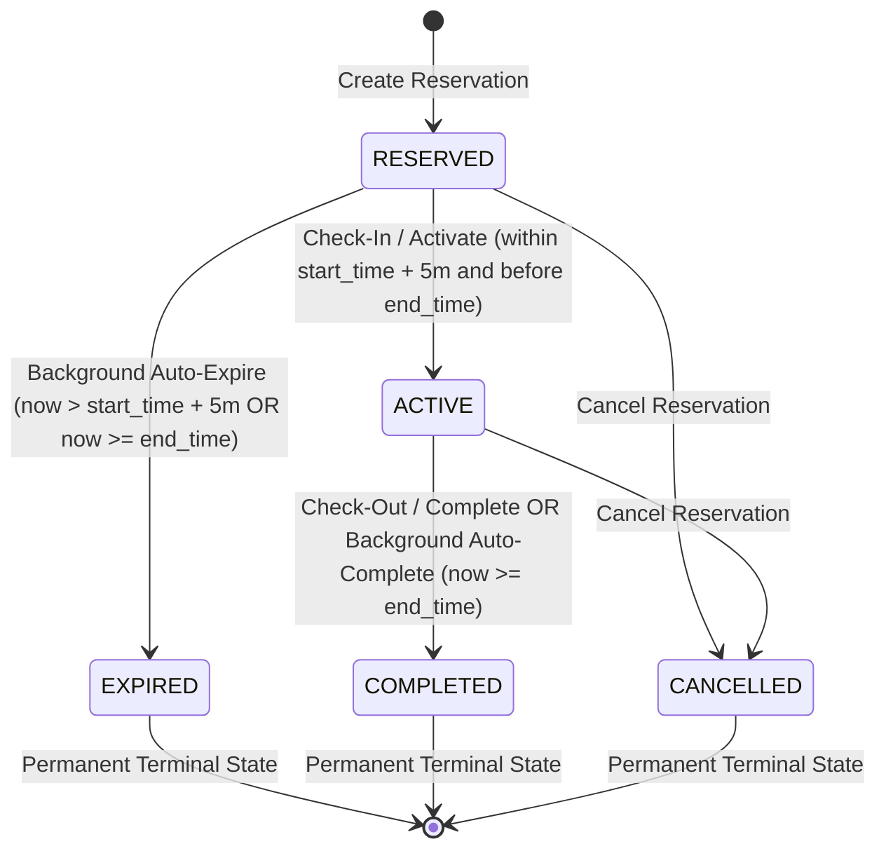

# Data Model: Expire Unclaimed Room Reservations

**Feature**: `007-expire-unclaimed-reservations`
**Date**: 2026-09-23

## Existing Entities & Schema Mapping

No new database tables or Flyway schema migrations are required for this feature. The existing database schema defined in `backend/src/main/resources/db/migration/V4__create_reservation_tables.sql` already includes the necessary columns, constraints, and indexes.

### Entity: `Reservation`

| Field | Java Type | DB Column | Constraints & Notes |
|---|---|---|---|
| `id` | `UUID` | `id` | Primary key (`@UuidGenerator`) |
| `room` | `Room` | `room_id` | Foreign key to `room(id)`, non-null |
| `seatingArrangement` | `SeatingArrangement` | `seating_arrangement_id` | Foreign key to `seating_arrangement(id)`, non-null |
| `startTime` | `Instant` | `start_time` | Non-null, start timestamp |
| `endTime` | `Instant` | `end_time` | Non-null, must be strictly after `start_time` |
| `status` | `ReservationStatus` | `status` | Non-null, enum string: `RESERVED`, `ACTIVE`, `COMPLETED`, `EXPIRED`, `CANCELLED` |
| `expectedAttendees`| `int` | `expected_attendees`| Positive integer (`>= 1`) |
| `note` | `String` | `note` | Optional longtext note |
| `createdBy` | `String` | `created_by` | Required creator user identifier |
| `createdAt` | `Instant` | `created_at` | Non-null, immutable creation timestamp |
| `updatedAt` | `Instant` | `updated_at` | Non-null, auto-updated modification timestamp |
| `version` | `Long` | `version` | Non-null, optimistic locking version counter |

---

## Domain Constants & Policies

```java
public final class ReservationPolicyConstants {
    /**
     * Standardized grace period before an unattended RESERVED booking transitions to EXPIRED.
     */
    public static final Duration CHECK_IN_GRACE_PERIOD = Duration.ofMinutes(5);

    /**
     * Interval between background checks for overdue unattended reservations.
     */
    public static final long EXPIRATION_POLL_INTERVAL_MS = 30_000L; // 30 seconds
}
```

---

## State Transition Diagram



---

## Invariants & Validation Rules

1. **Terminal State Invariant**: Once in `EXPIRED`, `COMPLETED`, or `CANCELLED`, a reservation cannot transition to any other status.
2. **Conflict Invariant**: Only reservations in `RESERVED` or `ACTIVE` status block room scheduling in `findConflictingReservations`. Once a reservation transitions to `EXPIRED` or `COMPLETED`, the room becomes instantly bookable for the remaining duration.
3. **Grace Period Invariant**: An unattended reservation in `RESERVED` status MUST NOT be transitioned to `EXPIRED` before `startTime + 5 minutes` has strictly elapsed (`now > startTime + 5 minutes`), UNLESS its scheduled `endTime` has elapsed (`now >= endTime`), in which case it expires immediately upon reaching `endTime`. Check-in is strictly rejected once `endTime` has elapsed.
4. **Optimistic Locking Invariant**: Any concurrent check-in attempt modifying `status` from `RESERVED` to `ACTIVE` will increment `version`. If the background expiration job attempts to commit concurrently, an `OptimisticLockingFailureException` is thrown, preventing corrupt or lost updates.
5. **Concluded Active Invariant**: Reservations in `ACTIVE` status whose scheduled `endTime` has elapsed (`now >= endTime`) are automatically transitioned to `COMPLETED` by the background sweep.
