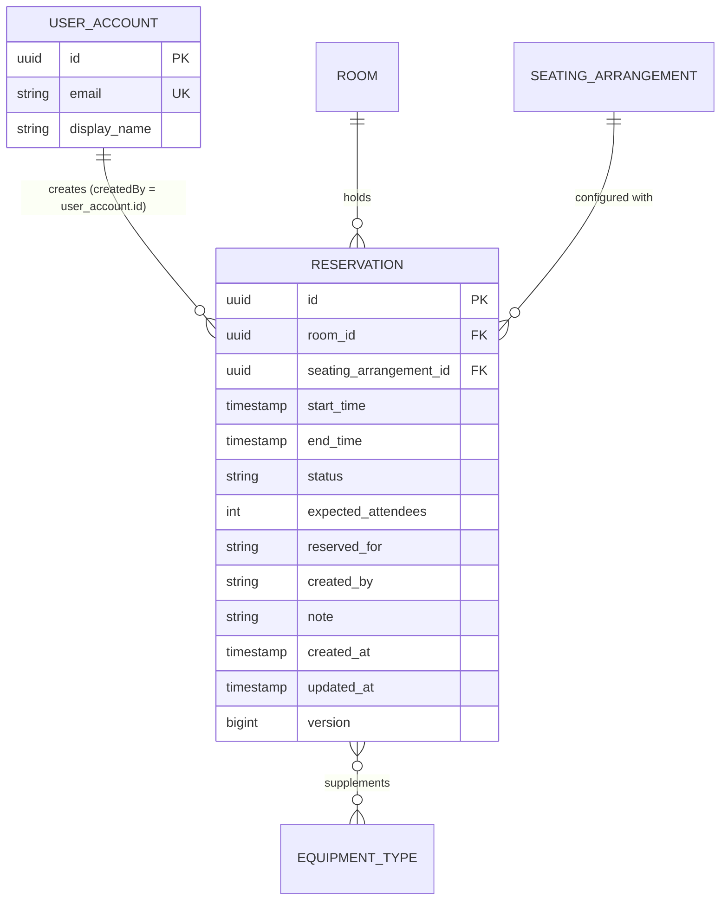

# Phase 1 Data Model: User Reservation Integration

## 1. Entities

### Reservation (Modified)

Represents a scheduled booking for a specific room and layout. Updated to record user account identity and designated recipient.

| Attribute | Type | Nullable | Validation / Constraints | Description |
|-----------|------|----------|---------------------------|-------------|
| `id` | `UUID` | No | Primary Key, auto-generated | Unique reservation identifier |
| `roomId` | `UUID` | No | Foreign Key (`room.id`), indexed | Reserved room reference |
| `seatingArrangementId` | `UUID` | No | Foreign Key (`seating_arrangement.id`) | Selected room arrangement layout |
| `startTime` | `Instant` (TIMESTAMPTZ) | No | Must be in future on creation, `< endTime` | Reservation beginning |
| `endTime` | `Instant` (TIMESTAMPTZ) | No | `> startTime` | Reservation conclusion |
| `status` | `ReservationStatus` (TEXT) | No | Enum: `RESERVED`, `ACTIVE`, `COMPLETED`, `EXPIRED`, `CANCELLED` | Lifecycle state |
| `expectedAttendees` | `Integer` | No | `>= 1`, `<= arrangement.maxCapacity` | Expected attendee count |
| `reservedFor` | `String` (VARCHAR(255)) | No | Trimmed length between 1 and 255 | **NEW**: Designated beneficiary or purpose of the booking |
| `createdBy` | `String` (TEXT) | No | Sourced from `AuthenticatedUser.userId().toString()`, immutable | Account ID of the creating user |
| `note` | `String` (TEXT) | Yes | Max 2000 chars | Optional booking notes |
| `additionalEquipment` | `List<EquipmentType>` | No | Relational join table `reservation_equipment` | Supplementary portable equipment |
| `createdAt` | `Instant` (TIMESTAMPTZ) | No | Auto-timestamp on insert, updatable = false | Creation timestamp |
| `updatedAt` | `Instant` (TIMESTAMPTZ) | No | Auto-timestamp on update | Last update timestamp |
| `version` | `Long` (BIGINT) | No | Optimistic lock version counter | Concurrency control |

### Database Constraints & Indexes

```sql
-- Migration: V10__add_reserved_for_and_user_reservation_index.sql
ALTER TABLE reservation ADD COLUMN reserved_for VARCHAR(255);
UPDATE reservation SET reserved_for = created_by WHERE reserved_for IS NULL;
ALTER TABLE reservation ALTER COLUMN reserved_for SET NOT NULL;
ALTER TABLE reservation ADD CONSTRAINT ck_reservation_reserved_for_nonempty
    CHECK (length(btrim(reserved_for)) BETWEEN 1 AND 255);

CREATE INDEX ix_reservation_user_upcoming
    ON reservation (created_by, status, end_time, start_time);
```

---

## 2. Validation & Business Rules

1. **Identity & Ownership (`createdBy`)**:
   - `createdBy` must strictly equal the authenticated user's ID (`UUID` formatted as string).
   - Once persisted, `createdBy` is immutable and cannot be modified by any update endpoint.
   - Unauthenticated attempts to create a reservation must fail immediately with HTTP 401 Unauthorized (`AUTH_REQUIRED`).

2. **Beneficiary Designation (`reservedFor`)**:
   - Mandatory on creation (`@NotBlank @Size(max = 255)`).
   - Pre-filled in the frontend booking form with `auth.user.displayName`.
   - The user may overwrite `reservedFor` with any text as long as trimmed length is between 1 and 255 characters.
   - May be updated via `PATCH /api/reservations/{id}` while status is `RESERVED`. If provided in update request, must not be blank and max 255 characters.

3. **Upcoming Scope Criteria**:
   - A reservation is considered "upcoming / current" if:
     1. `createdBy == currentAuthenticatedUserId`
     2. `status IN ('RESERVED', 'ACTIVE')`
     3. `endTime > currentClockInstant`
   - Concluded (`COMPLETED`), lapsed (`EXPIRED`), or revoked (`CANCELLED`) bookings are excluded.
   - Capped at maximum 10 items, sorted by `startTime ASC`.

---

## 3. Entity Relationships


