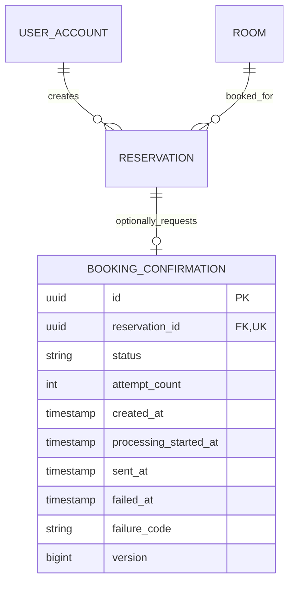

# Phase 1 Data Model: Optional Booking Confirmation Email

## 1. Transient Input: Notification Choice

The per-booking opt-in is transported in the reservation-create request and is not a persistent reservation or account preference.

| Attribute | Type | Required | Default | Validation / Meaning |
|-----------|------|----------|---------|----------------------|
| `emailNotification` | boolean | No | `false` | `true` requests one confirmation after successful commit; `false` or omitted requests none |

Rules:

- A newly opened form initializes the value to `false`.
- The submitted value is captured with the rest of the create request.
- Invalid or rolled-back booking attempts create neither a reservation nor a confirmation regardless of the value.
- The value is not stored on `reservation` or `user_account`; for a committed reservation, a `booking_confirmation` row is the durable evidence that notification was requested.
- Existing callers and legacy helpers that omit the property remain opted out.

## 2. Existing Entities Used

### Reservation

No existing reservation columns change. The feature reads:

| Attribute | Type | Rule | Use |
|-----------|------|------|-----|
| `id` | UUID | Primary key | Unique confirmation ownership when opted in |
| `room_id` | UUID | Required foreign key | Resolve room display name |
| `created_by_user_id` | UUID | Required for authenticated bookings | Resolve recipient account |
| `start_time` | Instant / TIMESTAMPTZ | Required | Render booking start |
| `end_time` | Instant / TIMESTAMPTZ | Required, after start | Render booking end |
| `status` | ReservationStatus | New booking starts `RESERVED` | Enqueue only after successful opted-in creation |

### UserAccount

No account columns change. The worker resolves `email` through `Reservation.createdByUserId`. Missing accounts or blank/invalid recipient data produce a terminal `RECIPIENT_UNAVAILABLE` failure without changing the reservation.

### Room

No room columns change. The worker reads the room's display `name`; special characters and umlauts are preserved in the UTF-8 message.

## 3. New Entity: BookingConfirmation

Represents one requested logical confirmation and its one permitted SMTP submission attempt. Opted-out reservations have no instance of this entity.

| Attribute | Type | Nullable | Validation / Constraint | Description |
|-----------|------|----------|-------------------------|-------------|
| `id` | UUID | No | Primary key, generated | Confirmation identifier used in privacy-safe logs |
| `reservationId` | UUID | No | FK to `reservation.id`, unique | At most one confirmation per reservation |
| `status` | enum/text | No | `PENDING`, `PROCESSING`, `SENT`, `FAILED` | Delivery lifecycle |
| `attemptCount` | integer | No | `0..1` | Number of claimed delivery-processing attempts; one claim permits at most one SMTP submission |
| `createdAt` | Instant | No | Set on insert | Queue age and delivery timing baseline |
| `processingStartedAt` | Instant | Yes | Required only for `PROCESSING` | Claim timestamp and stale-work detection |
| `sentAt` | Instant | Yes | Required only for `SENT` | Successful SMTP acceptance time |
| `failedAt` | Instant | Yes | Required only for `FAILED` | Terminal failure time |
| `failureCode` | string(64) | Yes | Fixed allowlisted code; required only for `FAILED` | Privacy-safe support classification |
| `version` | long | No | Optimistic lock version | Guards accidental concurrent finalization |

No opt-in boolean, recipient email, rendered subject/body, note, attendee data, or raw exception details are stored in this entity.

## 4. Database Constraints and Indexes

Planned migration: `V12__create_booking_confirmation.sql`.

```sql
CREATE TABLE booking_confirmation (
    id UUID PRIMARY KEY DEFAULT gen_random_uuid(),
    reservation_id UUID NOT NULL UNIQUE REFERENCES reservation (id),
    status TEXT NOT NULL DEFAULT 'PENDING',
    attempt_count INT NOT NULL DEFAULT 0,
    created_at TIMESTAMPTZ NOT NULL DEFAULT now(),
    processing_started_at TIMESTAMPTZ,
    sent_at TIMESTAMPTZ,
    failed_at TIMESTAMPTZ,
    failure_code VARCHAR(64),
    version BIGINT NOT NULL DEFAULT 0,
    CONSTRAINT ck_booking_confirmation_status
        CHECK (status IN ('PENDING', 'PROCESSING', 'SENT', 'FAILED')),
    CONSTRAINT ck_booking_confirmation_attempt_count
        CHECK (attempt_count BETWEEN 0 AND 1),
    CONSTRAINT ck_booking_confirmation_state_fields CHECK (
        (status = 'PENDING' AND attempt_count = 0 AND processing_started_at IS NULL
            AND sent_at IS NULL AND failed_at IS NULL AND failure_code IS NULL)
        OR (status = 'PROCESSING' AND attempt_count = 1 AND processing_started_at IS NOT NULL
            AND sent_at IS NULL AND failed_at IS NULL AND failure_code IS NULL)
        OR (status = 'SENT' AND attempt_count = 1 AND processing_started_at IS NOT NULL
            AND sent_at IS NOT NULL AND failed_at IS NULL AND failure_code IS NULL)
        OR (status = 'FAILED' AND failed_at IS NOT NULL AND sent_at IS NULL
            AND failure_code IS NOT NULL)
    )
);

CREATE INDEX ix_booking_confirmation_pending
    ON booking_confirmation (created_at, id)
    WHERE status = 'PENDING';

CREATE INDEX ix_booking_confirmation_processing
    ON booking_confirmation (processing_started_at, id)
    WHERE status = 'PROCESSING';
```

The implementation may adjust SQL formatting, but it must preserve the optional one-to-one reservation relationship, bounded attempts, state consistency, and partial queue indexes.

## 5. Relationships



Each reservation has zero confirmations when opted out and exactly one when opted in and committed successfully.

## 6. Lifecycle and Transaction Boundaries

```text
Reservation create request
        │
        ├── emailNotification=false or omitted
        │       └── commit Reservation only
        │
        └── emailNotification=true
                └── same transaction commits Reservation + PENDING
                                                        │ atomic claim
                                                        ▼
                                                   PROCESSING
                                                        │ SMTP outside DB transaction
                                                  ┌─────┴──────────┐
                                                  ▼                ▼
                                                SENT             FAILED
                                              (terminal)        (terminal)
```

- The checkbox value is evaluated only on reservation creation.
- For opt-in, the reservation and `PENDING` confirmation are inserted in one transaction. Rollback removes both.
- For opt-out, only the reservation is inserted; no later read, reload, edit, or lifecycle transition creates a confirmation.
- Only the authenticated production creation path may honor opt-in. The legacy direct-service helper used by tests/setup defaults to opt-out.
- Claiming uses a lock/compare-and-set so only one worker can move a row to `PROCESSING`.
- `PROCESSING` commits before SMTP begins; no database lock is held during network I/O.
- `SENT` and `FAILED` are terminal.
- A stale `PROCESSING` row is moved to `FAILED` with `WORKER_INTERRUPTED`; it is not retried automatically.
- Reservation status is never changed by confirmation transitions.

## 7. Failure Codes

### Persisted failure codes

Only these bounded codes may be stored in `booking_confirmation.failure_code`:

| Code | Meaning |
|------|---------|
| `RECIPIENT_UNAVAILABLE` | Account missing or no usable email |
| `MESSAGE_FORMAT_FAILED` | Required reservation/room/time data cannot be rendered |
| `SMTP_REJECTED` | Mail gateway rejected or could not submit the message |
| `WORKER_INTERRUPTED` | A claimed row became stale before terminal completion |

### Log-only operational code

`FINALIZATION_FAILED` is emitted only as a structured operational log event when a terminal state cannot be persisted. This code cannot reliably be stored in the affected confirmation row and MUST NOT be treated as a persisted status. Its log event must never include exception text or personal data.

## 8. Retention

Requested confirmation status rows remain attached to reservation history for operational traceability. Opted-out reservations add no notification record. Confirmation rows contain no duplicate recipient address, opt-in flag, or rendered body. Any future retention, preference, audit, or manual resend capability requires a separate specification because it changes privacy and duplicate-delivery semantics.
